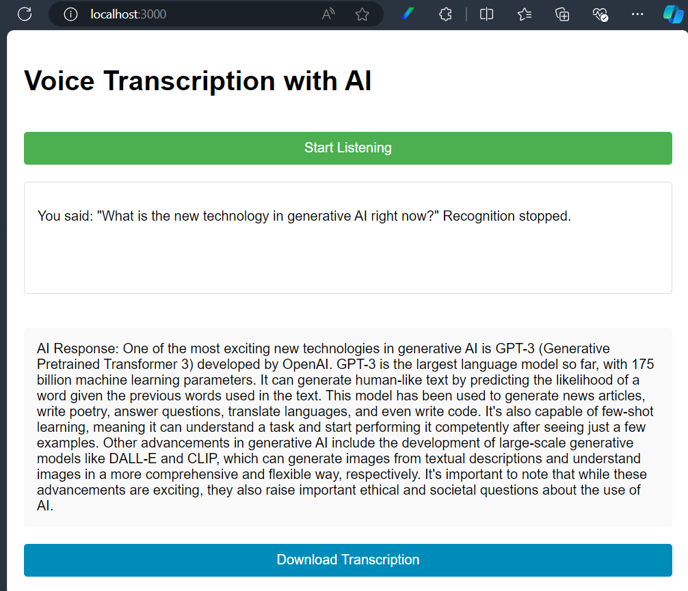

# Voice-to-Text AI Assistant

A real-time voice transcription application that uses OpenAI's GPT-4 to process and respond to voice input. This project demonstrates the integration of Web Speech API with OpenAI's API for natural language processing.

## Features

- Real-time voice-to-text transcription
- AI-powered responses using GPT-4
- Automatic saving of transcriptions
- Downloadable transcription files
- Clean and responsive UI

## Technologies Used

- Node.js
- Express.js
- OpenAI API (GPT-4)
- Web Speech API
- HTML/CSS/JavaScript

## Prerequisites

- Node.js (v14 or higher)
- NPM (Node Package Manager)
- OpenAI API key
- Modern web browser (Chrome recommended)

## Setup

1. Clone the repository:
```bash
git clone https://github.com/ymdarum/voice-transcription.git
cd voice-transcription
```

2. Install dependencies:
```bash
npm install
```

3. Set up environment variables:
   - Copy `.env.example` to create a new `.env` file:
   ```bash
   cp .env.example .env
   ```
   - Open `.env` and add your OpenAI API key:
   ```
   OPENAI_API_KEY=your-api-key-here
   ```

4. Create required directories:
```bash
mkdir transcriptions
```

5. Start the server:
```bash
npm start
```

6. Access the application:
   - Open your web browser
   - Navigate to `http://localhost:3000`
   - Allow microphone access when prompted

## Project Structure

```
voice-transcription/
├── catch.js              # Main server file
├── package.json          # Project dependencies
├── .env                  # Environment variables (create this)
├── .env.example         # Environment variables example
├── .gitignore           # Git ignore rules
├── public/              # Static files
│   └── index.html       # Main application page
└── transcriptions/      # Saved transcription files
```

## Usage

1. Click "Start Listening" to begin voice capture
2. Speak into your microphone
3. The application will:
   - Display your transcribed text
   - Generate an AI response using GPT-4
   - Save the transcription
   - Provide a download link

sample screenshot:


## Configuration

The application can be configured through environment variables:
- `OPENAI_API_KEY`: Your OpenAI API key (required)
- `PORT`: Server port (default: 3000)

## Troubleshooting

1. **Microphone not working:**
   - Ensure you're using a supported browser (Chrome recommended)
   - Check that you've granted microphone permissions
   - Verify your microphone is properly connected and selected

2. **Server Connection Issues:**
   - Verify the server is running (`npm start`)
   - Check you're accessing the correct URL (http://localhost:3000)
   - Ensure no other service is using port 3000

3. **OpenAI API Issues:**
   - Verify your API key is correctly set in `.env`
   - Check your API key has sufficient credits
   - Ensure you're not hitting rate limits

## Security Notes

- Never commit your `.env` file
- Keep your OpenAI API key secure
- Regularly rotate your API keys
- Monitor your API usage

## About

This project is part of my GenAI development portfolio, showcasing the integration of various AI technologies. As a tech enthusiast in Data & AI, I'm constantly exploring new ways to implement GenAI solutions.

## Contributing

Feel free to submit issues, fork the repository, and create pull requests for any improvements.

## License

MIT License - feel free to use this project for your own learning and development.

## Contact

For any questions or feedback, please reach out through [GitHub](https://github.com/ymdarum).
